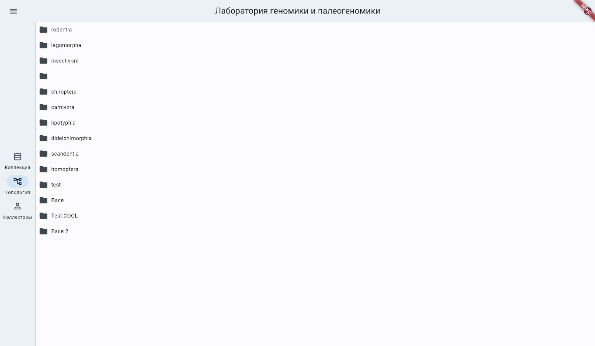
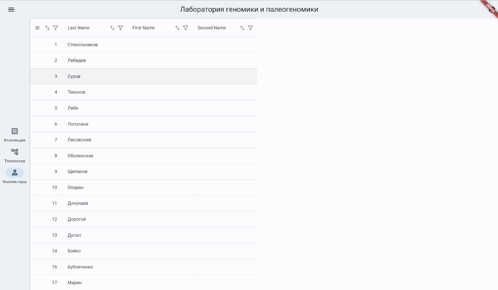
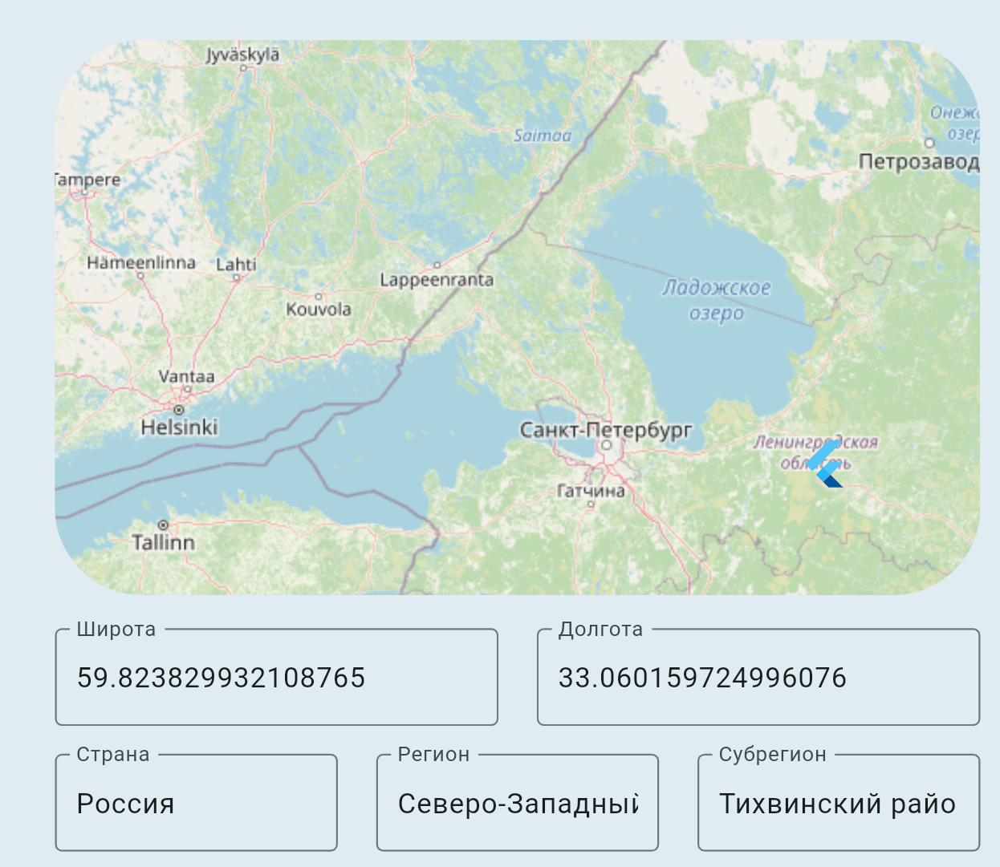
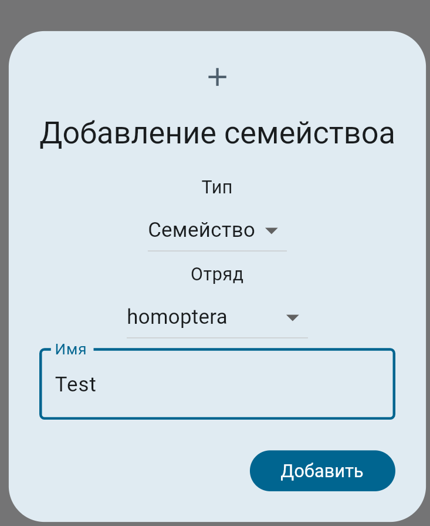
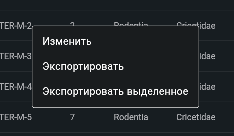

# Нормализация данных из таблицы Excel

В данном репозитории представлен скрипт для нормализации данных "Эволюционной геномики и палеогеномики"
из исходного Excel/CSV файла. Он исправляет простые ошибки и позволяет вставить эти данные в базу данных.

## Инструкция по запуску

Для запуска нужен Python **меньше 3.13**.

1. Установка пакетов

   ```shell
   pip install -r requirements.txt
   ```

2. Загрузка исходных данных в `./input_data/collection.csv`

3. Запуск

   ```shell
   python main.py
   ```

В итоге мы получим файле разделённые по таблицам, которые будут находится в `./output/`.

## Инструкция для пользователя к базе данных Лаборатории \"Эволюционной геномики и палеогеномики\" ЗИН РАН от 31.05.2024. 

При запуске информационный системы «Лаборатория геномики и
палеогеномики» пользователю открывается таблица коллекция и возможность
просматривать другие данные, такие как топология и коллекторы.

На рисунках представлен скриншот, демонстрирующий экраны приложения.






# Авторизация

Для добавления и редактирования записей необходимо войти в аккаунт, для
этого в правой стороне экрана нажмите на иконку пользователя. Иконка
вблизи, представлена на картинке 4.


Рисунок 4 -- Иконка пользователя

Откроется окно авторизации, представленное на рисунке 5.


Рисунок 5

После авторизации у вас появится кнопка для добавление новых записей,
она представлена на рисунке 6.


Рисунок 6 -- Навигация после авторизации

# Добавление записей

При нажатии на кнопку со знаком "плюс" на странице коллекция, появится
диалоговое окно, представленное на рисунке 7. "Id" и "Номер в каталоге"
устанавливаются автоматически. Остальное вводится вручную.


Рисунок 7 -- Диалог добавлении новой записи в коллекцию

Разберём несколько моментов, где у вас могут возникнуть трудности.
Первое - выбор топологии. При выборе топологии у вас откроется окно
подобное тому, что мы видели при просмотре топологии. Диалог выбора
топологии представлен на рисунке 8.


Рисунок 8 -- Диалог выбора топологии

Учтите, что необходимо нажимать на название топологии, а не значок
папки, после этого надо нажать кнопку добавить, для того чтобы добавить
топологию в новую запись. Если вы всё сделали верно, то у вас будет
подобное отображение полной топологии, как и на рисунке 9.


Рисунок 9 -- Отображения после выбора

С коллекторов, аналогичная ситуация, только для выбора необходимо
нажимать на строки в таблице. Диалог выбора коллекторов представлен на
рисунке 10. Если нужного коллектора нет в базе данных, обратитесь к
пункту 3 Добавление новых коллекторов.


Рисунок 10 -- Выбор авторов

При всех верных действиях вы получите фамилии коллекторов, под кнопкой,
как и на рисунке 11.


Рисунок 11 -- Выбор коллекторов

Для выбора точки на карте, придуман упрощённый ввод, он позволяет нажать
правой точкой мыши на место и самостоятельно заполнить все ваши данные.
На рисунке 12 представлен точка, с автоматическими заполненными полями.



Рисунок 12 -- Выбор места топологии

При нажатии на кнопку добавить ваша запись будет добавлена.

# Добавление новых коллекторов

При нажатии на кнопку со знаком "плюс" на странице коллекторы, появится
диалоговое окно(Рисунок 13).


Рисунок 13 -- Диалоговое окно для добавления или изменения коллектора

# Изменение топологии

Совсем иная ситуация с топологией, после авторизации в экране топологии
у вас появятся кнопки со знаком «+». Отображение этого изображено на
рисунке 14.


Рисунок 14-- Топология после авторизации

После нажатия на данную кнопку у вас появится окно где у вас будут
заполнены некоторые данные в зависимости от уровня на котором вы
находитесь. Вы можете самостоятельно преключать уровень, меняя значение
в вводе «Тип»



Рисунок 15 -- Диалоговое окно для добавления или изменения топологии

# Редактирование записей

Теперь разберёмся, как редактировать записи в коллекции, для этого
нажмите правой кнопкой мышкой по строке и выберите «Изменить», кнопка
представлена на рисунке 16. После этого появится диалоговое окно для
изменения данных.


Рисунок 16 -- Выбор места топологии

#  Фильтрация записей

Для фильтрации записей используется значок Фильтра. Он есть у каждой
колонки(вид/род/возраст/коллектор/и тп).


Фильтрация по всем параметрам происходит аналогично. Приведем пример.

Допустим, нам надо выбрать записи 34, 35, 246.

При нажатии значка фильтра появляется диалоговое окно.


Мы можем:

\- скролить колесиком вниз-вверх и выбирать нужные цифры


\- искать нужные цифры в поиске и выбирать(**[При использовании поиска
предыдущие выбранные значения сбрасываются!!!!!!!!!)]{.mark}**

Чтобы нам выбрать все три числа, мы можем выбрать первые два, поставив
галочку. ЗАТЕМ нажимаем "ХОРОШО". Открывается выбранное окно с двумя
выбранными записями. Мы можем их скачать "Экспортировать выделенное" или
мы можем их добавить в новый список. Для этого надо кликнуть по записям
(Они останутся во временной памяти).


Затем нажать снова значок фильтра и выбрать опцию очистить фильтр.

Снова в поиске ищем число 246, выделяем и нажимаем "Хорошо".

Кликаем по появившейся строке, нажимаем правую кнопку мыши и выбираем
опцию "экспортировать выделенное". На ваш компьютер загрузится файл
collection_selected.xlsx c тремя выбранными числами.

# Скачивание записей

Для скачивания выбранных записей нажмите правую кнопку мыши, появится
окно с вариантами "Экспортировать" -- экспортировать всю таблицу,
"Экспортировать выбранное" -- экспортировать выбранные строки



# Заключение

Для необходимой безопасности рекомендуется выходить из аккаунта после
совершения операций с данными.
